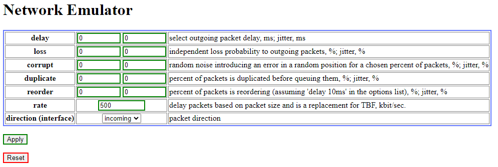
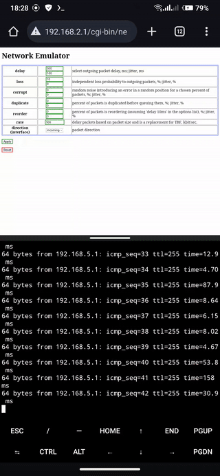

# netem_gui_openwrt

Проект представляет собой реализацию простого web-интерфейса (GUI) для удобного управления утилитой [netem](https://openwrt.org/docs/guide-user/network/traffic-shaping/sch_netem) (эмулятор трафика) на устройствах с [OpenWRT](https://openwrt.org/ru/supported_devices).  
Целью является упрощение отладки сетевых приложений и устройств. Можно эмулировать 2G, 3G, ADSL, да что угодно и в каких угодно условиях. В GUI добавлены

Вдохновлен проектами: [trafficcop](https://github.com/shuhaowu/trafficcop) и [openwrt-traffic-emulator](https://github.com/vdchuyen/openwrt-traffic-emulator).  

## Как установить:  
1. Установить пакет `kmod-netem` и его зависимости (`tc`,`kmod-sched`) через web-интерфейс или командой `opkg install tc kmod-netem kmod-sched`.  
1. Проверить интерфейсы в начале файла `ne`:  
	```
	#interfaces
	ifi='br-lan' #incoming
	ifo='wlan0' #outgoing
	```
	Если есть отличия, то нужно исправить на ваши. Я подключаюсь к интернету через `wifi`, потому для меня `ifo='wlan0'`, у вас это может быть `eth1` при проводном подключении, тогда будет так: `ifo='eth1'`.   
	
1. Скопировать файл `ne` в `/www/cgi-bin/`  
1. Выдать файлу `ne` права на запуск (`chmod 775 /www/cgi-bin/ne`)  

## Использование:  
Перейдите на `http://<router_ip>/cgi-bin/ne`, где `<router_ip>` - ip вашего устройства с `OpenWRT`.  
Там вас встретит интерфейс:  
  
Введите необходимые вам настройки для эмулирования сети и выберите для какого интерфейса применить правило. Для установки выбранных настроек нажмите на кнопку `Apply`.  
Для сброса правил на обоих интерфейсах нажмите кнопку `Reset`.  

_Кстати! После применения и обновления страницы значения в полях не отображают текущих настроек правил. Они показывают только последние введенные значения в эти поля._  

## Демонстрация:  
  

### <b><font color="#FF0000">Предупреждение!</font></b>  
Код не имеет средств авторизации, GUI доступно по прямому адресу.  
Кроме того хак получения параметров из `QUERY_STRING` с использованием `eval` может привести к выполнению кода с уровнем прав `root`, переданного в GET-запросе.  
В зависимости от выбранного интерфейса, параметров правил и того, через какой интерфейс управляете вы, можно затруднить себе управление или вовсе его потерять. Но правила сбрасываются после перезагрузки, потому в худшем случае вам придется дойти до устройста и перезагрузить его.  
Вы должны осознавать все это, используя данный код.  
